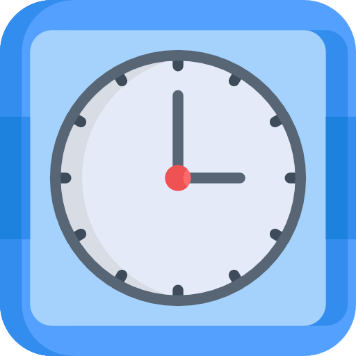
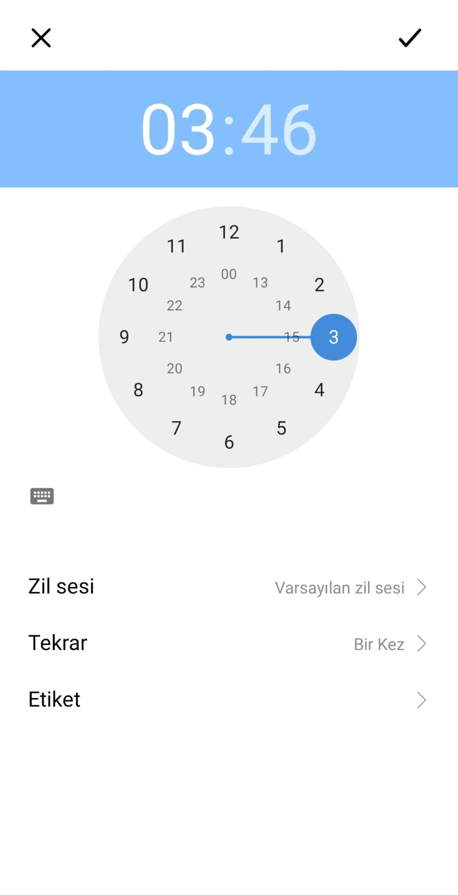

 

  

  <h3 align="center">Clock Tracker App</h3>

  

    It is an alarm setting android application.
     
     
    <a href="https://github.com/etokoc/ClockTracker">View Demo</a>
    .
    <a href="https://github.com/etokoc/ClockTracker/issues">Report Bug</a>
    .
    <a href="https://github.com/etokoc/ClockTracker/issues">Request Feature</a>
  

      

## Table Of Contents

* [About the Project](#about-the-project)
* [Built With](#built-with)
* [Usage](#usage)
* [Contributing](#contributing)
* [License](#license)
* [Authors](#authors)
* [Acknowledgements](#acknowledgements)

## About The Project

This project is written in android kotlin. The aim of the project is to customize the alarm application on all android smart devices for ourselves.

Here's why:

* We wanted to customize the alarm system.
* We wanted to learn many new things
* We aimed to learn how to install software architecture.

## Built With

We wrote this project in Kotlin/Android

## Usage

First, fork the project. Then review classes, libraries used.
## ScreenShots

## Contributing

Contributions are what make the open source community such an amazing place to be learn, inspire, and create. Any contributions you make are **greatly appreciated**.
* If you have suggestions for adding or removing projects, feel free to [open an issue](https://github.com/etokoc/ClockTracker/issues/new) to discuss it, or directly create a pull request after you edit the *README.md* file with necessary changes.
* Please make sure you check your spelling and grammar.
* Create individual PR for each suggestion.
* Please also read through the [Code Of Conduct](https://github.com/etokoc/ClockTracker/blob/main/CODE_OF_CONDUCT.md) before posting your first idea as well.

### Creating A Pull Request

1. Fork the Project
2. Create your Feature Branch (`git checkout -b feature/ClockTracker`)
3. Commit your Changes (`git commit -m 'Add some ClockTracker'`)
4. Push to the Branch (`git push origin feature/ClockTracker`)
5. Open a Pull Request

## License

Distributed under the MIT License. See [LICENSE](https://github.com/etokoc/ClockTracker/blob/main/LICENSE.md) for more information.

## Authors

* **Ertugrul KOC** - *Android Developer* - [Ertugrul KOC](https://github.com/etokoc/) - **
* **Omer Seyfettin YAVUZYIGIT** - *Android Developer* - [Omer Seyfettin YAVUZYIGIT](https://github.com/omeryavuzyigit61) - **

## Acknowledgements

* [Ertugrul KOC](https://github.com/etokoc/)
* [Omer Seyfettin YAVUZYIGIT](https://github.com/omeryavuzyigit61)
* 
